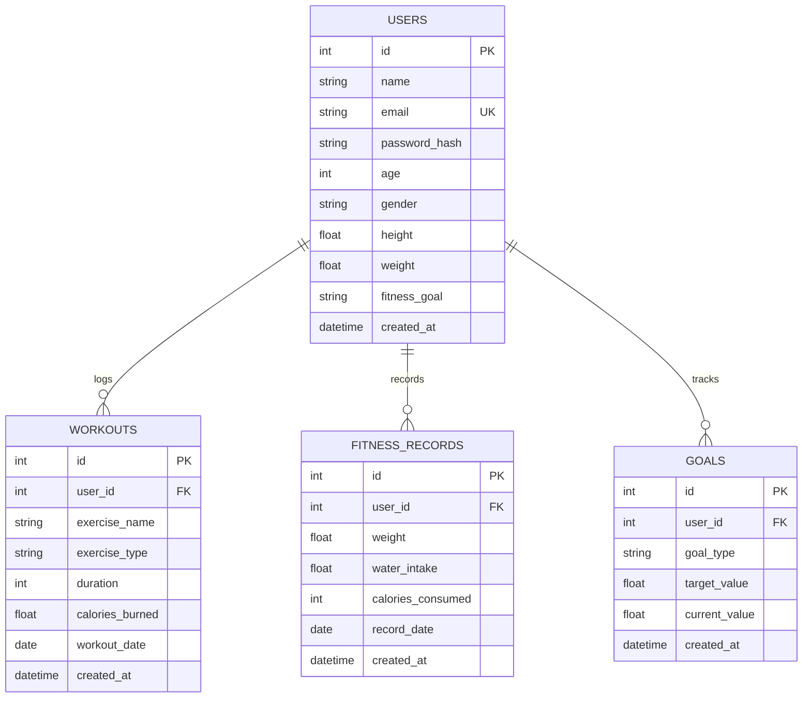

# FitTrack — Personal Fitness Management System

> A production-grade, full-stack personal fitness tracking web application built with Python, Flask, SQLAlchemy, SQLite, HTML5, modern CSS3, and Vanilla JavaScript.

[](https://www.python.org/)
[](https://flask.palletsprojects.com/)
[](https://www.sqlalchemy.org/)
[]()
[]()

---

## 1. Overview

**FitTrack** is designed to provide individuals with an intuitive, responsive, and data-driven platform to monitor daily health and fitness metrics. Built with a strict layered architecture and zero reliance on heavy frontend frameworks, FitTrack demonstrates clean monolithic web development principles, robust session authentication, complete CRUD operations, automated BMI calculation, interactive Chart.js analytics, and strict user-data authorization boundaries.

---

## 2. Key Features

- **User Authentication & Session Management**:
  - Secure registration, login, and session persistence using Werkzeug password hashing.
  - Ownership enforcement preventing cross-user data leakage.
- **Dynamic Dashboard**:
  - Time-of-day greeting (e.g., *"Good evening, Pavan 👋"*).
  - 5 Real-time Stat Cards: BMI Index with WHO category badge, Current Weight, Daily Water Intake, Daily Calorie Consumption, and Daily/Weekly Workout count.
- **Automated Health & BMI Calculations**:
  - Automatic conversion and calculation of BMI (\(\text{weight} / \text{height}^2\)).
  - Informational WHO classifications: Underweight, Normal, Overweight, Obese.
- **Workout Tracking & Analytics (CRUD)**:
  - Log workouts with exercise type (Strength, Cardio, Running, Cycling, Walking, Yoga, Other), duration, calories burned, and date.
  - Instant UI update without full-page reloads.
  - One-click deletion with confirmation dialogs.
- **Daily Health Logging**:
  - Track weight, water intake (L), and caloric consumption (kcal) per day.
  - Automatically updates latest profile weight and recalculates live BMI.
- **Goal Management**:
  - Set fitness goals (Weight Loss, Weight Gain, Muscle Building, General Fitness, Endurance).
  - Visual progress bars with percentage completion and completion badges.
- **Visual Progress Charts**:
  - **Weight Progress Chart**: Line graph illustrating weight trajectory over time.
  - **7-Day Workout Activity Chart**: Dual-axis bar and line chart illustrating session frequency and calories burned.
  - Graceful empty states when insufficient data exists.
- **Modern Responsive Design**:
  - Dark SaaS design aesthetic with glassmorphism touches, custom CSS variables, and zero generic Bootstrap styling.
  - Custom toast notification engine for asynchronous feedback.
  - Seamless layout responsiveness across mobile, tablet, and desktop screens.

---

## 3. Technology Stack

- **Backend**: Python 3.10+, Flask 3.x, Flask-SQLAlchemy 3.x, Werkzeug (security)
- **Database**: SQLite with SQLAlchemy ORM (cascade deletes, indexing, foreign keys)
- **Frontend**: HTML5, Modern CSS3 (custom design system), Vanilla JavaScript (ES6+, Fetch API, async/await)
- **Data Visualization**: Chart.js (via CDN)
- **Testing**: pytest

---

## 4. Architecture

FitTrack implements a clean, layered architecture with strict separation of concerns:

```
[ Frontend (HTML5 / Modern CSS3 / Vanilla JS / Chart.js) ]
                        ↓ (Fetch API)
[ REST API / Flask Blueprints (Routes & Controllers) ]
                        ↓
[ Service Layer (fitness_service.py, workout_service.py) ]
                        ↓
[ SQLAlchemy ORM Models (User, Workout, FitnessRecord, Goal) ]
                        ↓
[ SQLite Database (instance/fittrack.db) ]
```

---

## 5. Project Structure

```
personal-fitness-management-system/
│
├── app/
│   ├── __init__.py               # Flask Application Factory (create_app)
│   ├── models/
│   │   ├── __init__.py           # Database instance & model exports
│   │   ├── user.py               # User model & password hashing
│   │   ├── workout.py            # Workout session model
│   │   ├── fitness_record.py     # Daily health metrics model
│   │   └── goal.py               # Fitness goal model
│   │
│   ├── routes/
│   │   ├── __init__.py           # Auth decorators (@login_required) & helpers
│   │   ├── auth.py               # Authentication views & REST endpoints
│   │   ├── dashboard.py          # Dashboard view & aggregated metrics API
│   │   ├── workout.py            # Workout CRUD endpoints
│   │   ├── fitness.py            # Fitness metrics endpoints
│   │   ├── profile.py            # User profile endpoints
│   │   └── goal.py               # Fitness goal endpoints
│   │
│   ├── services/
│   │   ├── __init__.py           # Service exports
│   │   ├── fitness_service.py    # BMI calculation, categorization & metrics
│   │   └── workout_service.py    # Workout queries, stats & chart aggregation
│   │
│   ├── templates/
│   │   ├── base.html             # Shell layout, navbar, modals, toasts
│   │   ├── login.html            # User sign in page
│   │   ├── register.html         # User registration page
│   │   └── dashboard.html        # Interactive dashboard interface
│   │
│   └── static/
│       ├── css/
│       │   └── style.css         # Modern dark SaaS design system
│       └── js/
│           ├── toast.js          # Reusable toast notification system
│           ├── api.js            # Standardized fetch wrapper
│           ├── auth.js           # Authentication form handling
│           ├── dashboard.js      # Dashboard state & Chart.js controllers
│           ├── workout.js        # Workout logging & deletion
│           ├── fitness.js        # Daily health metrics modal
│           ├── profile.js        # Profile editing with live BMI preview
│           └── goal.js           # Goal creation, update & deletion
│
├── instance/
│   └── fittrack.db               # SQLite database file
│
├── tests/
│   ├── __init__.py
│   ├── conftest.py               # Test fixtures (in-memory SQLite)
│   ├── test_auth.py              # Auth & session test suite
│   ├── test_fitness.py           # Fitness logic & BMI calculation tests
│   ├── test_workout.py           # Workout CRUD & ownership tests
│   └── test_goal.py              # Goal progress & authorization tests
│
├── config.py                     # Dev, Test, Prod configuration classes
├── run.py                        # Application entry point & demo seeder
├── requirements.txt              # Production and test dependencies
├── README.md                     # Comprehensive technical documentation
├── .gitignore                    # Git exclusions
└── .env.example                  # Environment variables template
```

---

## 6. Database Design



---

## 7. REST API Documentation

### Authentication
| Method | Endpoint | Description | Auth Required |
|---|---|---|---|
| `POST` | `/api/auth/register` | Register new user account | No |
| `POST` | `/api/auth/login` | Authenticate user & start session | No |
| `POST` | `/api/auth/logout` | Terminate active session | Yes |
| `GET` | `/api/auth/me` | Fetch authenticated user details | Yes |

### Dashboard
| Method | Endpoint | Description | Auth Required |
|---|---|---|---|
| `GET` | `/api/dashboard` | Aggregated user stats, recent workouts, goals, and chart datasets | Yes |

### Workouts
| Method | Endpoint | Description | Auth Required |
|---|---|---|---|
| `GET` | `/api/workouts` | Retrieve all workouts for logged-in user | Yes |
| `POST` | `/api/workouts` | Create a new workout session | Yes |
| `GET` | `/api/workouts/<id>` | Retrieve specific workout details | Yes |
| `DELETE`| `/api/workouts/<id>` | Delete workout (ownership enforced) | Yes |

### Fitness Metrics
| Method | Endpoint | Description | Auth Required |
|---|---|---|---|
| `GET` | `/api/fitness` | Retrieve historical daily fitness records | Yes |
| `POST` | `/api/fitness` | Save/update weight, water intake, calories | Yes |

### Profile
| Method | Endpoint | Description | Auth Required |
|---|---|---|---|
| `GET` | `/api/profile` | Retrieve user profile & current BMI | Yes |
| `PUT` | `/api/profile` | Update profile attributes | Yes |

### Goals
| Method | Endpoint | Description | Auth Required |
|---|---|---|---|
| `GET` | `/api/goals` | Retrieve all goals with progress percentages | Yes |
| `POST` | `/api/goals` | Create a new fitness target | Yes |
| `PUT` | `/api/goals/<id>` | Update target or current value | Yes |
| `DELETE`| `/api/goals/<id>` | Remove fitness goal | Yes |

---

## 8. Installation & Setup

### Prerequisites
- Python 3.10 or higher
- Git (optional)

### Step 1: Create and Activate Virtual Environment
```bash
# Clone or navigate to the project directory
cd personal-fitness-management-system

# Create virtual environment
python -m venv venv

# Activate virtual environment
# Windows (PowerShell):
.\venv\Scripts\Activate.ps1
# Windows (CMD):
venv\Scripts\activate.bat
# Linux / macOS:
source venv/bin/activate
```

### Step 2: Install Dependencies
```bash
pip install -r requirements.txt
```

### Step 3: Configure Environment
Copy `.env.example` to `.env` (optional, defaults are pre-configured for instant development):
```bash
cp .env.example .env
```

---

## 9. Running the Application

### Option A: Standard Run
```bash
python run.py
```
Open your browser and navigate to: `http://127.0.0.1:5000`

### Option B: Quick Demo Seed (Recommended for Demonstrations)
To instantly populate a rich 7-day history with sample workouts, health metrics, and active goals:
```bash
python run.py seed-demo
python run.py
```

**Demo Credentials**:
- **Email**: `demo@fittrack.com`
- **Password**: `Password123!`

---

## 10. Automated Testing

FitTrack comes with a comprehensive automated test suite testing authentication, security boundaries, BMI calculation edge cases, workout CRUD, and goal tracking.

To execute tests:
```bash
python -m pytest -v tests/
```

### Test Suite Summary:
```
tests/test_auth.py::test_register_success PASSED                         [  5%]
tests/test_auth.py::test_register_duplicate_email PASSED                 [ 11%]
tests/test_auth.py::test_register_validation PASSED                      [ 16%]
tests/test_auth.py::test_login_success PASSED                            [ 22%]
tests/test_auth.py::test_login_invalid_password PASSED                   [ 27%]
tests/test_auth.py::test_logout PASSED                                   [ 33%]
tests/test_auth.py::test_unauthorized_access PASSED                      [ 38%]
tests/test_fitness.py::test_bmi_calculation PASSED                       [ 44%]
tests/test_fitness.py::test_bmi_category PASSED                          [ 50%]
tests/test_fitness.py::test_goal_progress_calculation PASSED             [ 55%]
tests/test_fitness.py::test_save_fitness_record PASSED                   [ 61%]
tests/test_fitness.py::test_save_fitness_record_invalid PASSED           [ 66%]
tests/test_goal.py::test_create_and_list_goals PASSED                    [ 72%]
tests/test_goal.py::test_update_and_delete_goal PASSED                   [ 77%]
tests/test_workout.py::test_create_and_get_workout PASSED                [ 83%]
tests/test_workout.py::test_create_workout_validation PASSED             [ 88%]
tests/test_workout.py::test_delete_workout PASSED                        [ 94%]
tests/test_workout.py::test_unauthorized_workout_access PASSED           [100%]

============================= 18 passed in 3.30s ==============================
```

---

## 11. Screenshots & Interface Preview

| Feature | Description |
|---|---|
| **Welcome Hero & Stat Cards** | Displays dynamic greeting, live BMI, category badge, weight, water, calories, and today's workouts. |
| **Progress Charts** | Interactive line chart for body mass trajectory and dual-axis chart for weekly workout frequency and calories. |
| **Recent Workouts Table** | Clean table displaying exercise name, type badge, duration, calories, date, and single-click delete. |
| **Active Goals Grid** | Visual progress indicators with percentage completions and target metrics. |
| **Interactive Modals** | Accessible modal overlays for logging workouts, entering daily health metrics, setting goals, and editing profile. |

---

## 12. Security Considerations

- **Password Hashing**: Utilizes PBKDF2 with SHA-256 via Werkzeug (`generate_password_hash` / `check_password_hash`).
- **Resource Authorization**: Every API query strictly filters by `user_id == session['user_id']`. Attempting to access or delete another user's records returns `403 Forbidden`.
- **Session Protection**: Cookies configured with `HTTPOnly` and `SameSite=Lax`.
- **SQL Injection Prevention**: 100% parameterized queries executed via SQLAlchemy ORM.
- **Input Sanitization**: Server-side numeric range and date format validation, plus client-side HTML escaping against XSS.

---

## 13. Future Enhancements

- CSV / PDF export for workout and health logs.
- Custom macro-nutrient breakdown (Protein, Carbohydrates, Fats).
- Wearable device API sync (Google Fit, Apple Health).
- Social leaderboards and achievement badges.

---

## 14. License

This project is licensed under the MIT License — see the [LICENSE](LICENSE) file for details.
